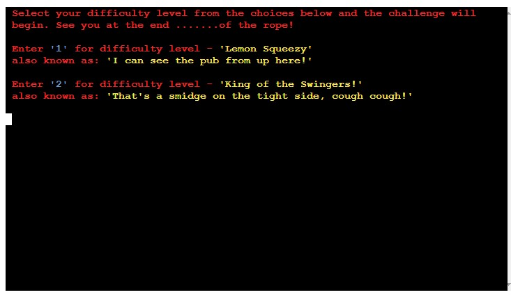
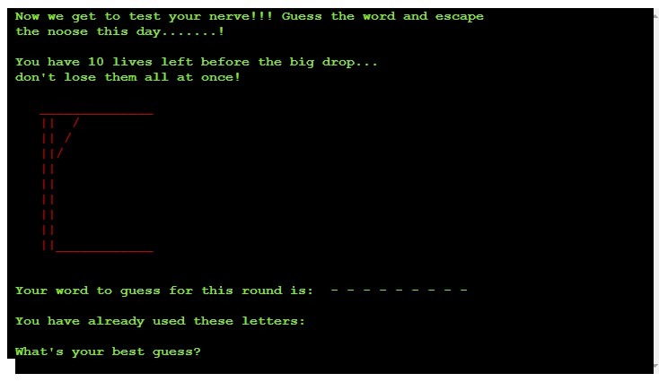
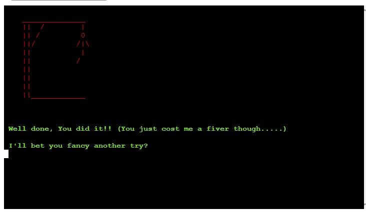
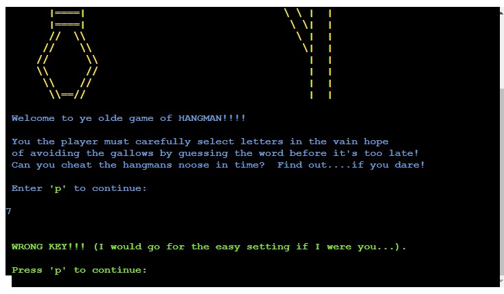
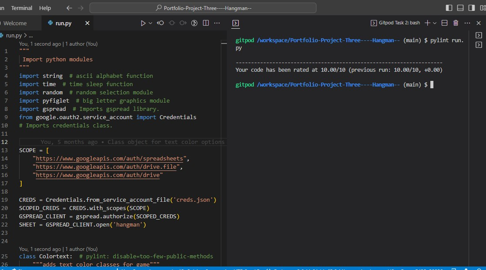
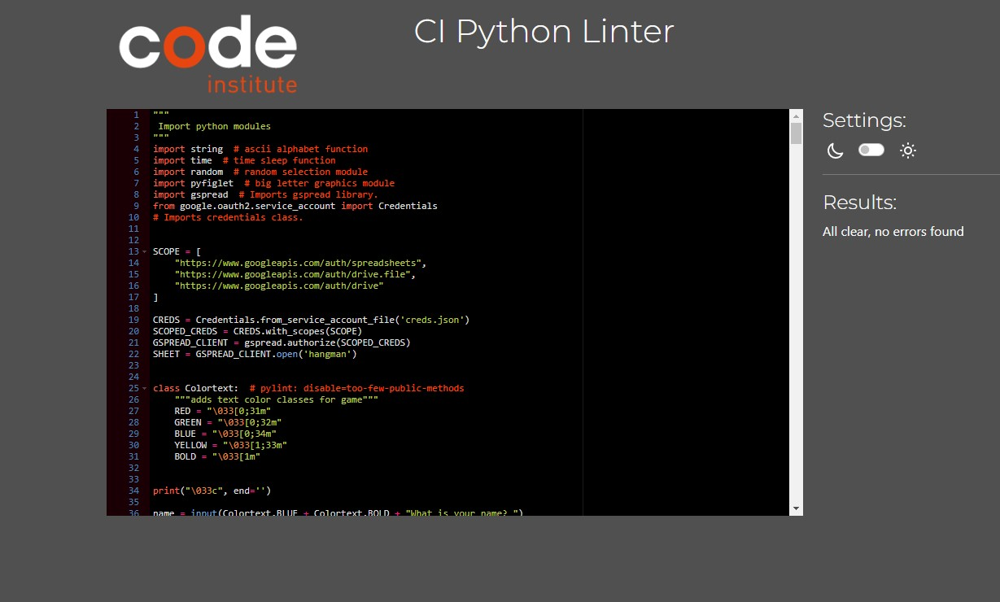

# **Hangman(with added sarcasm)**
Hangman(with added sarcasm) is written as a Python terminal game. This will run on the Code Institute terminal viewer on Render.com . Render was chosen as a suitable alternative to Heroku.

As per the standard Hangman rules, Users try to guess the word by inputting letters until they either guess the word or they lose all of their lives and forfeit the game. The target audience is anyone who likes to challenge themselves mentally with a guessing game. 

[Hangman(with added sarcasm)](https://python-essentials-pp3-hangman.onrender.com/) - You can view the live site here. 

 

## **Table of Contents**
 * [**How to Play**](#how-to-play)
 * [**Planning Stage**](#planning-stage)
 * [**Features**](#features)
 * [**Testing**](#testing)
 * [**Languages Used**](#languages)
 * [**Bugs**](#bugs)
 * [**Deployment**](#deployment)
 * [**Credits**](#credits)

## **How to Play**
Players play Hangman(with added sarcasm) by typing letters into the mock terminal. The purpose of the game is to guess the hidden word. The words are represented with empty dashes to show players how many letters they have to guess in order to win. when the player guesses a correct letter, the individual dashes are replaced with the correct letter.

When a player guesses incorrectly, they will receive an error message and the players lives will reduce by one. The player will then be invited to continue to input their guesses until thier total lives have run out or the word has been correctly guessed. 

The game is over either when the player has correctly guessed the word or they have run out of lives. 

 * [**Back to contents**](#table-of-contents)

## **Planning Stage**

### **User Goals**
To build a terminal based game of Hangman for users to mentally challenge themselves with a fun guessing - game platform.
* The game rules and environment should be easily interpreted and accessible for a user.
* The game should definitely be lots of fun to play.
* It should be suitably challenging and encourage users to replay many times.

### **User Journey**

* The user is introduced to the intro screen, setting the scene and getting them ready to play a game of Hangman. It requests that they enter their name in order to make the game more personal and interactive. It encourges participation by asking the user to enter 'p' to engage with the game play environment. The application responds with helpful feedback if the input is not appropriate.
* The user is now in the challenge level choice screen. They are encouraged to choose which level of difficulty they wish to activate. The application responds with helpful feedback if the input is not appropriate.
* The game play screen confirms the player difficulty choice and sets the game environment for the player. The player then has to continue to input letter guesses to se if they can guess the complete word before they run out of lives. The application responds with helpful feedback if the input is not appropriate.
* If the player wins or loses they get appropriate feedback and in the case of losing, the word they did not guess in time. After short pause they are taken to a screen where they are asked if they want to play another game or not. The application responds with helpful feedback if the input is not appropriate.
* If the player chooses to play they are taken to the challenge level choice screen. If they do not wish to continue they are taken back to the intro screen. The application responds with helpful feedback if the input is not appropriate.

### **Using FlowCharts**
 During the planning process, in order to assist with the development progress and to figure out the linear process of the game I created the following flowchart.

* Where were inputs from the user needed?
* How would I deal with invalid inputs or incorrect tries?
* Were there any logic errors that could perceivably break the game?
* How to utilise API's in order to retrieve random words for the game from an external data source.

 

 * [**Back to contents**](#table-of-contents)

## **Features**

 ### **Existing Features**
* Home/Start page
* Explains Game play to user
* Explains how to continue


* Choose challenge difficulty
* 'Lemon Squeezy' = 10 lives and smaller, easier to guess word choice.
* 'King of the Swingers!' = 5 lives and longer, harder to guess word choice.



* View Game Rules



* A function randomly generates a word from google spreadsheets utilising google API's to access the data held on the sheets.
* The player can not see what the word is but can see how many letters are in the word, denoted by _ _ _ _ _ 
* Lives are shown through graphical representation of the "hangman"
* Depending on difficilty level chosen, the user has a limited amount of lives before game ends.
   
 

* Game Over Screens.
* A custom comment appears for winning the game and for game over.

 


* Users can choose whether to restart the game or go back to the main menu.



* Checks for invalid inputs.
* For all user inputs, checks are run to ensure there are no invalid inputs submitted.
* For any invalid submissions, a tailored error message is displayed and the user is prompted to input their selection again.

## **Future Functionality Ideas**
* An option for the user to input the whole word if they guess it correctly before the game is over.
* Increase the level of difficulty by adding a third option where each turn is timed. If the timer runs down a life is lost..
* increase number of words available in game word files.
* Create a scoreboard with the names of the top 5 most recent, successful players. 

 * [**Back to contents**](#table-of-contents)

## **Testing**
* The pep8online website, as recommended in the code institute course material,  was offline and unavailable for use at the time of submission however the Code Institute Python Linter was available. The following steps were also taken to validate and correct the python code and remove any errors. PEP8 compliance was not only checked within the CI linter but also checked with pylint within the gitpod ide environment. Following the correction of all line length errors, the adding of required docstrings for the method import section, correction of the 'invalid escape sequences' errors for the noose graphic at the start of the game, refactoring the while loop on line 276, and confirming that the Colortext class is storing the color styles for the text within the program, the final pylint score was 10.00, as confirmed via the screenshot below:

  

* The Code institute python linter validation is also confirmed via the following screenshot:



* The application was also strenuously tested by manually inputting all possible iterations of user responses and measuring the outcome within the expected parameters to confirm all were functioning as they should be. This was then tested further through external users playing the game in order to check that all functionality worked appropriately. The finished version worked correctly through each user iteration without issue. (both within the IDE and the deployed environment.)

* Manual Testing results

| User input tested| Expected Result | Actual Result |
| :--- | :--- | :---
| Enter name at start of game  | Name displayed correctly on start game screen | Correctly displayed |
| User prompt to press letter 'p' to continue. (Correct input entered)  | 'Good Luck' should be displayed User should be taken to the difficulty choice screen | 'Good Luck' is displayed and user is progressed to difficulty choice screen |
| User prompt to press letter 'p' to continue. (Incorrect input entered)  | Error message should be displayed | Error message is displayed correctly |
| User is given choice of difficulty level. Either '1' or '2'. ('1' chosen)  | Appropriate choice 'message' should be displayed and the  user will be taken to game screen where they will be given 10 lives and a 5 letter word to guess. | Correct output is displayed and correct number of lives and word length are provided for game play. |
| User is given choice of difficulty level. Either '1' or '2'. ('2' chosen)  | Appropriate choice 'message' should be displayed and the  user will be taken to game screen where they will be given 5 lives and a 9 letter word to guess. | Correct output is displayed and correct number of lives and word length are provided for game play. |
| User is given choice of difficulty level. Either '1' or '2'. (Incorrect input entered) | Error message should be displayed | Error message is displayed correctly |
User has to guess a letter within the word and input the letter (Letter choice in word.) | Appropriate message should be displayed confirming choice. Letter should be displayed within the word space and the used letter should be displayed in the used letters section. User should be prompted that the letter si in the word and then continue to play | Correct output is displayed and user is informed that the letter is in the word Player is prompted to continue play. |
| User has to guess a letter within the word and input the letter (Letter choice in word. All letters correctly guessed and lives remaining) | Appropriate message should be displayed confirming choice. Letter should be displayed within the word space and the used letter should be displayed in the used letters section. User should be prompted with win message and then taken to play again screen | Correct output is displayed and user is informed that the game has been won. Player is prompted to either play again or quit. |
|  User has to guess a letter within the word and input the letter (Letter choice not in word)  | Appropriate message should be displayed confirming that the letter is not within the game word. The used letter should be displayed in the used letters section. The hanged man image should add another section to show that the player has lost a life. User should be prompted to continue play, if enough lives remain. | Correct output is displayed and user is prompted to continue if enough lives remain. |
|  User has to guess a letter within the word and input the letter (Letter choice not in word. No lives remain) | Appropriate game over message should be displayed while confirming that the letter is not within the game word. The hanged man image should be completed signifying the end of the game and that the user has lost the game. The used letter should be displayed in the used letters section. The screen should then ask the user if they wish to play again or quit. | Correct output is displayed and user is informed that the game has been lost. Player is prompted to either play again or quit. |
|  User has to guess a letter within the word and input the letter (incorrect data provided by user. Not a letter) | Error message displayed and user prompted to continue game play | Correct error message is displayed and user is prompted to continue playing.
|  User has to input either 'y' to play agin or 'n' to reset the game ('y' chosen)  | Continuation message should be displayed and then user should be taken back to difficulty level selection screen | Correct message is displayed and is displayed and user is progressed to difficulty choice screen .
|  User has to input either 'y' to play agin or 'n' to reset the game ('n' chosen)  | Conciliatory message should be displayed and then user should be taken back to start of game application | Correct message is displayed and start of application screen displayed.
|  User has to input either 'y' to play agin or 'n' to reset the game (Incorrect input entered) | Error message should be displayed | Error message is displayed correctly |

## **Languages**
* Python.
## **Bugs**
* When implementing hangman graphics, initially lives retreated from fully hanged man to nothing. I simply reversed the order of the graphics and set appropriately to solve the issue.
* Line length was a particular headache especially with the use of a lot of text within the game. This meant carefully checking and adjusting the code particularly when using methods to customise the text. 
* When retrieving a random word form the google sheet the selected words initially appeared in the following format - ['example'] - after searching for insight online, Stack Overflow provided a solution with the following string indexing added to the code - [2:-2] returning the selected words in the correct format for the game - example -
* The graphical element 'the noose image' at the start of the game provided some issues regarding the error messages referring to the back slashes as 'invalid escape sequences'. This was remedied by using the raw string prefix 'r' to specify a string that uses specific characters that have a special meaning within python.
* A missing-module-docstring error indicated that the module imports at the start of the game required an additional docstring.

 * [**Back to contents**](#table-of-contents)

## **Deployment**
* This project was deployed with Heroku using Code Institute's mock terminal as provided with the Python Essentials template.

* To deploy:

* Clone or fork this public repository
* Create a Heroku account (if not already existing)
* Create a new app with Heroku
* In **Settings**, add 2 buildpacks:
    - ```Python```
    - ```NodeJS```
    
    Ensure the buildpacks are created in that order!

* Allowing Heroku access to GitHub, link the new app to the relevant repository
* Choose whether or not to enable **Automatic Deploys**. If enabled, the deployed app will update automatically with each push to GitHub
* Click **Deploy**

 * [**Back to contents**](#table-of-contents)

  ## **Credits**
 * [Code Institute](https://codeinstitute.net/) plus the extended Code Institute community via Slack for their invaluable support. How to deploy to Render following the changes in the Heroku platform hosting options from November 2022.

 * [Code Institute Tutorial Love Sandwiches](https://github.com/GrumpyRobot21/lovesandwiches) for the video lessons and discussion around using google sheets as a database plus a guide on how to add and use the appropriate google API's 

 * [Stack Overflow](https://stackoverflow.com/) as the place to go for wise counsel and informative solutions to coding issues.

 * [FreeCodeCamp](https://www.freecodecamp.org/) for the following python hangman tutorial where the basis of the game code was derived from - [kying18/hangman]https://github.com/kying18/hangman/blob/master/hangman.py.

 * Thanks to my Mentor, Marcel, providing support and encouragement.

  * [**Back to contents**](#table-of-contents)