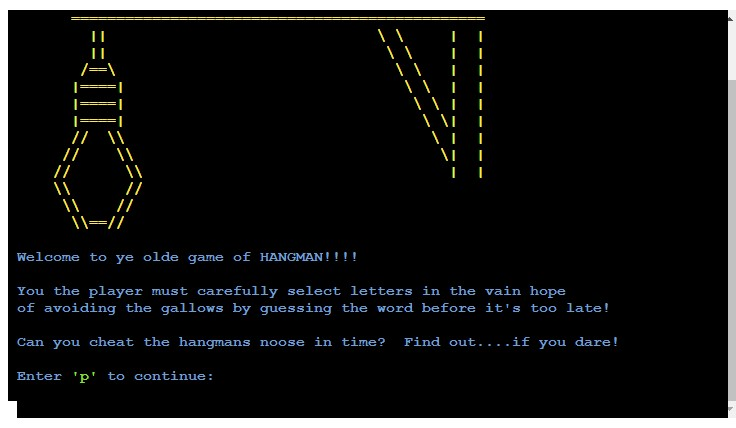
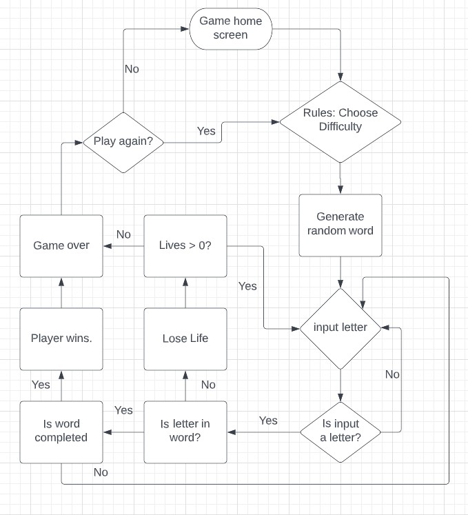

# **Hangman(with added sarcasm)**
Hangman(with added sarcasm) is written as a Python terminal game. This will run on the Code Institute terminal viewer on Heroku (until the Heroku free offering cconcludes in November 2022). A suitable alternative for hosting the live app following that date is currently being researched.

As per the standard Hangman rules, Users try to guess the word by inputting letters until they either guess the word or they lose all of their lives and forfeit the game. The target audience is anyone who likes to challenge themselves mentally with a guessing game. 

[Hangman(with added sarcasm)](https://hangman-pproj3.herokuapp.com/) - You can view the live site here. 

 

## **Table of Contents**
 * [**How to Play**](#how-to-play)
 * [**Planning Stage**](#planning-stage)
 * [**Features**](#features)
 * [**Testing**](#testing)
 * [**Languages Used**](#languages)
 * [**Bugs**](#bugs)
 * [**Deployment**](#deployment)
 * [**Credits**](#credits)

## **How to Play**
Players play Hangman(with added sarcasm) by typing letters into the mock terminal. The purpose of the game is to guess the hidden word. The words are represented with empty dashes to show players how many letters they have to guess in order to win. when the player guesses a correct letter, the individual dashes are replaced with the correct letter.

When a player guesses incorrectly, they will receive an error message and the players lives will reduce by one. The player will then be invited to continue to input their guesses until thier total lives have run out or the word has been correctly guessed. 

The game is over either when the player has correctly guessed the word or they have run out of lives. 

 * [**Back to contents**](#table-of-contents)

## **Planning Stage**

### **User Goals**
To build a terminal based game of Hangman for users to mentally challenge themselves with a fun guessing - game platform.
* The game rules and environment should be easily interpreted and accessible for a user.
* The game should definitely be lots of fun to play.
* It should be suitably challenging and encourage users to replay many times.

### **User Journey**

* The user is introducced to the intro screen, setting the scene and getting them ready to play a game of Hangman. It requests that they enter their name in order to make the game more personal and interactive. It encourges participation by asking the user to enter 'p' to engage with the game play environment. The application responds with helpful feedback if the input is not appropriate.
* The user is now in the challenge level choice screen. They are encouraged to choose which level of difficulty they wish to activate. The application responds with helpful feedback if the input is not appropriate.
* The game play screen confirms the player difficulty choice and sets the game environment for the player. The player then has to continue to input letter guesses to se if they can guess the complete word before they run out of lives. The application responds with helpful feedback if the input is not appropriate.
* If the player wins or loses they get appropriate feedback and in the case of losing, the word they did not guess in time. After short pause they are taken to a screen where they are asked if they want to play another game or not. The application responds with helpful feedback if the input is not appropriate.
* If the player chooses to play they are taken to the challenge level choice screen. If they do not wish to continue they are taken back to the intro screen. The application responds with helpful feedback if the input is not appropriate.

### **Using FlowCharts**
 During the planning process, in order to assist with the development progress and to figure out the linear process of the game I created the following flowchart.

* Where were inputs from the user needed?
* How would I deal with invalid inputs or incorrect tries?
* Were there any logic errors that could perceivably break the game?
* How to utilise API's in order to retrieve random words for the game from an external data source.

 

 * [**Back to contents**](#table-of-contents)